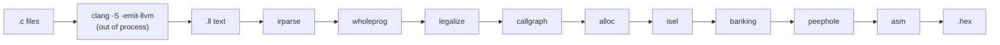
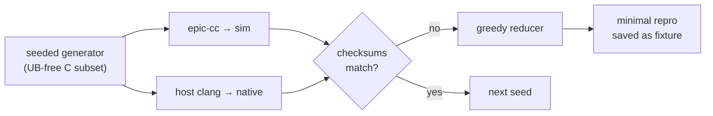

# epic-cc

**A whole-program C compiler for 8-bit Microchip PIC microcontrollers, written in Rust.**

[](https://github.com/apojomovsky/epic-cc/actions/workflows/ci.yml)
[](rust-toolchain.toml)
[](docs/09-build-environment.md)
[](docs/01-target-pic14.md)
[](#status)

`epic-cc` takes `.c` files and emits Intel HEX you can flash. It uses **clang as an
out-of-process front end** and implements a **custom whole-program PIC14 backend** —
deliberately *not* an LLVM backend. It owns every stage from LLVM IR text down to the
assembler, with no external assembler or linker in the shipping product.

```console
$ cat add.c
volatile unsigned char in;
volatile unsigned char out;
void main(void) { out = in + 1; }

$ cargo run -p driver -- add.c add.hex && cat add.hex
:020000040000FA
:10000000012800308A0005206300831203132008B2
:0E001000A2002208013EA3002308A100080060
:00000001FF
```

---

## Contents

- [Why this target is hard](#why-this-target-is-hard)
- [Architecture](#architecture)
- [What it builds on](#what-it-builds-on)
- [How correctness is verified](#how-correctness-is-verified)
- [Status](#status)
- [Getting started](#getting-started)
- [Repository layout](#repository-layout)
- [Design documentation](#design-documentation)
- [Non-goals](#non-goals)

---

## Why this target is hard

Parsing C is a solved problem. The difficulty of a PIC14 compiler is concentrated almost
entirely in **storage allocation**, because the mid-range core violates nearly every
assumption a conventional backend is built on.

| Constraint | Consequence for the compiler |
|---|---|
| **One accumulator (`W`), 35 instructions, no register file** | Nothing for classical register allocation to allocate. Everything is `W` ⇄ memory. |
| **4 banks of RAM** selected via `RP1:RP0` | Every cross-bank access needs a `BANKSEL`. Minimising them is NP-hard even with fixed bank assignment. |
| **16 bytes of common RAM** (`0x70–0x7F`, mirrored into all banks) | The only `BANKSEL`-free storage — half of what llvm-mos gets on the 6502. |
| **8-level hardware call stack, not addressable** | No stack frames, no recursion, and call depth is a hard resource. Every local must be statically allocated and **overlaid** across the call graph. |
| **Harvard architecture** | `const` tables live in program memory, reachable only through `RETLW` jump tables. LLVM IR assumes one flat address space. |
| **368 bytes RAM / 8K words flash** | Code-size and RAM pressure are correctness concerns, not just quality ones. |

Full detail — with the datasheet cross-references — in
[`docs/01-target-pic14.md`](docs/01-target-pic14.md).

> **The allocator is the compiler.** That single sentence explains every architectural
> decision below.

---

## Architecture

The compiler is a **ten-stage pipeline**, each stage its own crate, and — the load-bearing
property — **every stage boundary is a diffable text artifact**. A miscompile can be
bisected to a stage before anyone reads code.



| # | Stage | In → Out |
|---|---|---|
| 1 | [`driver`](crates/driver) | `.c` files → invokes clang → `.ll` |
| 2 | [`irparse`](crates/irparse) | `.ll` text → our IR |
| 3 | [`wholeprog`](crates/wholeprog) | N modules → one merged module, externs resolved |
| 4 | [`legalize`](crates/legalize) | i16/i32/float ops → i8 sequences + runtime calls |
| 5 | [`callgraph`](crates/callgraph) | merged IR → call graph, recursion check, ISR trees, stack-depth check |
| 6 | [`alloc`](crates/alloc) | call graph + locals → static addresses across 4 banks |
| 7 | [`isel`](crates/isel) | IR → PIC14 instructions |
| 8 | [`banking`](crates/banking) | `BANKSEL` / `PAGESEL` insertion |
| 9 | [`peephole`](crates/peephole) | pattern-driven cleanup |
| 10 | [`asm`](crates/asm) | instructions → Intel HEX |

### The three decisions that shape everything

**1. clang out-of-process, not an LLVM backend.**
clang emits LLVM IR *as text*; we parse the `.ll` and go our own way. We never link
libLLVM and never touch SelectionDAG, GlobalISel, TableGen, or MCTargetDesc.

This is a cost argument, not a capability one. "LLVM cannot target accumulator machines" is
false — llvm-mos disproves it. But llvm-mos paid **22,421 lines of diff from upstream
outside their own target directory**, and `llvm-pic` attempted *this exact target* with
three people over ~18 months, with mentorship from the llvm-mos team, and was archived in
November 2025 without working `CALL`/`GOTO` and without having started on banking at all.
Text in, text out sidesteps a permanent rebase against a 30-million-line C++ tree.
([ADR-001](docs/03-decisions.md))

**2. Whole-program compilation, down to HEX.**
All `.c` files compile in one invocation. Locals cannot live on a stack, so frames are
statically allocated and overlaid using the *whole* call graph — which requires whole-program
visibility by construction. This is also why we own the assembler: 35 instructions and a
fixed 14-bit encoding make it cheap, and it keeps allocation and encoding in one place.
([ADR-002](docs/03-decisions.md))

**3. `-target msp430` as a datalayout proxy.**
We are not generating MSP430 code. We want clang's ABI-independent type decisions, and
MSP430's datalayout is a near-perfect match for PIC14: 8-bit `char`, 16-bit `int`, 16-bit
pointers, byte alignment. Optimization runs at `-O1` — `-Oz` emits arbitrary-width integers
(`i17`) and intrinsics that a machine with no hardware multiply cannot lower pleasantly.

---

## What it builds on

`epic-cc` is deliberately thin on runtime dependencies and thick on test-time oracles.

| Project | Role | Where |
|---|---|---|
| **clang** (pinned 20.1.8) | The C front end. Runs out-of-process, emits `.ll` text. The *only* build-time external dependency. | [ADR-001](docs/03-decisions.md), [ADR-007](docs/03-decisions.md) |
| **gputils / `gpasm`** (1.5.2) | Test-time oracle. Our HEX must match `gpasm`'s **byte for byte**. Never a build dependency. | [`crates/asm/tests`](crates/asm/tests) |
| **llvm-mos** | Prior art, techniques only — static stack allocation and imaginary registers, reimplemented rather than ported. | [ADR-003](docs/03-decisions.md) |
| **Nix + direnv** | The whole toolchain, pinned in `flake.lock`. clang's version is part of our *input format*, so a silent bump could change what the parser sees. | [`docs/09-build-environment.md`](docs/09-build-environment.md) |
| **cvise / creduce / csmith** | Available in the dev shell for test-case reduction work. | [`docs/05-verification.md`](docs/05-verification.md) |

**On XC8:** Microchip's XC8 is treated as a **black-box differential oracle only** — compile
the same source, compare observable behaviour. Its binaries are never disassembled or
reverse-engineered; the licence forbids it and it is the slow path regardless
([ADR-006](docs/03-decisions.md)). The dev shell detects an XC8 install if you have one, but
**the XC8 differential runner is designed, not yet wired into the test suite** — today's
differential testing runs against host clang (see below). XC8 is never a build dependency
and CI does not require it.

**Licensing boundary:** `gputils` and `gpsim` are GPL. They are invoked as external
processes from the test harness and never linked into the compiler.

---

## How correctness is verified

Verification was built **before** most of the compiler — the oracle exists before the thing
it judges. Four independent layers, all running in CI:

### 1. Our own PIC14 simulator

[`crates/sim`](crates/sim) — a deterministic PIC14 instruction-set simulator, embeddable
directly in `cargo test`. Tests assert on RAM and internal state, and can inject an interrupt
at an exact program counter to make ISR timing reproducible. Owning it keeps a GPL process
boundary out of the inner test loop.

### 2. `gpasm` byte-for-byte cross-check

14 tests assemble our emitted `.asm` with real `gpasm` and require the resulting Intel HEX to
match our assembler's output **exactly**. This isolates *"our assembler is wrong"* from
*"our codegen is wrong"* — two failure modes that otherwise look identical.

### 3. End-to-end acceptance programs

15 e2e tests in [`crates/driver/tests`](crates/driver/tests) push real C through the entire
pipeline and run the resulting HEX in the simulator, asserting hand-computed results. Each
fixture documents its expected values and *why* the program is shaped the way it is:

| Fixture | Exercises |
|---|---|
| [`scalar.c`](crates/driver/tests/fixtures/scalar.c) | 8/16-bit arithmetic, all `icmp` predicates, `select` |
| [`overlay.c`](crates/driver/tests/fixtures/overlay.c) | Frame overlay — sibling functions sharing RAM |
| [`banked.c`](crates/driver/tests/fixtures/banked.c) / [`banked_ptr.c`](crates/driver/tests/fixtures/banked_ptr.c) | Cross-bank access and `BANKSEL` correctness |
| [`ptr_probe.c`](crates/driver/tests/fixtures/ptr_probe.c), [`array.c`](crates/driver/tests/fixtures/array.c), [`structs.c`](crates/driver/tests/fixtures/structs.c) | `FSR`/`INDF` indirect access, `sret`/`byval` |
| [`const_table.c`](crates/driver/tests/fixtures/const_table.c) | Harvard `const` data via `RETLW` tables, past the 256-byte window |
| [`multi_page.c`](crates/driver/tests/fixtures/multi_page.c) | `PCLATH` discipline across flash page boundaries |
| [`interrupt.c`](crates/driver/tests/fixtures/interrupt.c) | ISRs, SFR access, context save, duplicated shared helpers |
| [`long.c`](crates/driver/tests/fixtures/long.c) / [`muldiv.c`](crates/driver/tests/fixtures/muldiv.c) | 32-bit `long`, soft mul/div/mod runtime |
| [`float.c`](crates/driver/tests/fixtures/float.c) | IEEE-754 single soft-float, incl. round-to-nearest-even |

### 4. Differential fuzzing with automatic reduction

[`crates/fuzz`](crates/fuzz) closes the loop that makes unsupervised work viable:



The generator emits **unsigned-only, layout-agnostic** C with explicit-width types so PIC and
host semantics provably coincide — no signed overflow, shifts always below width, nonzero
divisors, field-wise struct access only. Every program is compiled twice and the checksums
must match; a mismatch, a panic, or a non-halting run is a bug, and the greedy reducer
minimises it to a saved reproducer. A 200-seed integer corpus and a 50-seed float corpus run
under `--ignored`; a fast subset gates every commit.

**Loud panics, never silent miscompiles.** Every unsupported construct panics with a specific
message rather than emitting wrong code. Recursion is rejected at compile time, and call
depth is checked against the 8-level hardware stack.

---

## Status

**Alpha — the full integer, pointer, interrupt, `long` and soft-float spine is implemented
and passing end-to-end.** As of this commit: **354 tests passing**, 6 slow corpus tests
behind `--ignored`.

### Supported C surface

| Feature | State |
|---|---|
| Core C89 control flow, non-recursive calls | ✅ |
| 8-bit and 16-bit integers, all comparisons | ✅ |
| Pointers, arrays, structs (`sret` / `byval`) | ✅ |
| `const` data in flash (`RETLW` tables, >256 bytes) | ✅ |
| Frame overlay across the call graph | ✅ |
| Multi-bank RAM (`BANKSEL`) and multi-page flash (`PCLATH`) | ✅ |
| Interrupts, SFR access, ISR-shared function duplication | ✅ |
| 32-bit `long` + soft mul/div/mod runtime | ✅ |
| IEEE-754 single-precision soft-float | ✅ |
| Unions | ⛔ not yet |
| Recursion | ⛔ by design — compile error, no escape hatch in v1 |

### Known gaps

These are deliberate and tracked, not surprises:

- **Diagnostics are panics.** Unsupported input aborts with a precise message instead of a
  user-facing error. Correct, but not yet friendly.
- **Device support is hard-coded to the PIC16F877A.** The
  [device-description-as-data](docs/03-decisions.md) design (ADR-004) is not implemented;
  there is no `devices/*.toml` yet.
- **`BANKSEL` minimisation is linear tracking**, reset at every label — not the published
  CASES'06 2-approximation the design calls for.
- **Overlay allocation is call-graph-based**, not interference-graph colouring; common RAM
  currently holds fixed scratch/retval bytes rather than serving as a general imaginary
  register file.
- **`.asm` / `.lst` / `.map` output** is not yet exposed by the driver, which emits HEX only.
- **XC8 and gpsim oracles** are designed but not wired into the suite.

---

## Getting started

Everything comes from a Nix flake — **install nothing system-wide.**

```bash
direnv allow                      # one time; the shell then activates on `cd`
cargo test --workspace            # 354 tests
```

Or, one-shot for automation:

```bash
nix develop --command cargo test --workspace
nix develop --command bash scripts/ci-test.sh   # per-crate PASS/FAIL table (what CI runs)
```

Compile a C file to Intel HEX:

```bash
nix develop --command cargo run -p driver -- crates/driver/tests/fixtures/add.c out.hex
```

Run the slow fuzz corpora:

```bash
nix develop --command cargo test -p fuzz -- --ignored
```

Pinned by `flake.lock`: **rustc 1.97.1**, **clang 20.1.8**, **gpasm 1.5.2**, plus cvise,
creduce and csmith. Gotchas — including why new files must be `git add`ed before
`nix develop` can see them — are in
[`docs/09-build-environment.md`](docs/09-build-environment.md).

---

## Repository layout

```
crates/
  driver/      stage 1  — clang invocation + full pipeline, plus the e2e acceptance suite
  irparse/     stage 2  — LLVM IR text parser
  ir/                   — the IR data model (text in, text out)
  wholeprog/   stage 3  — module merging
  legalize/    stage 4  — wide/float ops → i8 sequences + runtime calls
  callgraph/   stage 5  — call graph, recursion check, stack-depth check
  alloc/       stage 6  — static overlay allocation across 4 banks
  isel/        stage 7  — instruction selection
  banking/     stage 8  — BANKSEL / PAGESEL insertion
  peephole/    stage 9  — pattern cleanup
  asm/         stage 10 — assembler → Intel HEX (+ gpasm cross-checks)
  sim/                  — PIC14 instruction-set simulator
  fuzz/                 — differential generator, runner and reducer
docs/                   — design conversation, ADRs, milestone plans
scripts/ci-test.sh      — the workspace test gate (CI and local)
flake.nix               — the pinned toolchain
```

---

## Design documentation

The full design conversation is captured in `docs/` and is written to be sufficient on its
own.

**Start here:** [`docs/08-status-and-next-steps.md`](docs/08-status-and-next-steps.md)
(where we are), then [`docs/12-backend-design.md`](docs/12-backend-design.md) (the approved
consolidated backend spec).

| Doc | What it covers |
|---|---|
| [`00-charter.md`](docs/00-charter.md) | Goal, scope, non-goals |
| [`01-target-pic14.md`](docs/01-target-pic14.md) | The PIC14 architecture and exactly why it is hostile to C |
| [`02-prior-art.md`](docs/02-prior-art.md) | Survey: llvm-mos, llvm-pic, SDCC, XC8, gputils, gpsim, key papers |
| [`03-decisions.md`](docs/03-decisions.md) | ADRs, with rejected alternatives and rationale |
| [`04-pipeline-design.md`](docs/04-pipeline-design.md) | The ten-stage pipeline |
| [`05-verification.md`](docs/05-verification.md) | Oracles, simulator, differential testing, fuzzing, reduction |
| [`06-environment.md`](docs/06-environment.md) | Toolchain setup and reference material |
| [`07-references.md`](docs/07-references.md) | Books, papers, datasheets |
| [`09-build-environment.md`](docs/09-build-environment.md) | Nix dev shell, pinned versions, gotchas |
| [`10-spike-findings.md`](docs/10-spike-findings.md) | Feasibility spike: is `.ll` text a workable substrate? |
| [`11-pointer-const-findings.md`](docs/11-pointer-const-findings.md) | Feasibility spike: pointers via `FSR`/`INDF`, Harvard `const` |
| [`12-backend-design.md`](docs/12-backend-design.md) | **The approved backend spec** |
| [`13-`…`28-`](docs/) | Per-milestone implementation plans (harness → integer spine → pointers → interrupts → `long` → fuzzing → soft-float) |

Working notes for contributors and agents are in [`CLAUDE.md`](CLAUDE.md).

---

## Non-goals

- **Separate compilation.** Whole-program is the point — overlay allocation needs the full
  call graph.
- **Debugger / COFF / ELF output.** HEX, listing and map only.
- **Being an XC8 clone.** Differential testing against XC8 is a *verification technique*, not
  a design target. Beating XC8 free-mode optimization is a nice-to-have.
- **Reverse-engineering XC8.** Prohibited by its licence, and unnecessary
  ([ADR-006](docs/03-decisions.md)).
