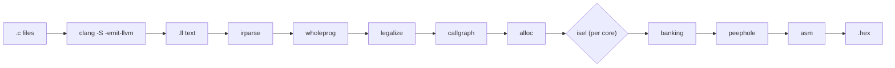

<p align="center">
  <picture>
    <source media="(prefers-color-scheme: dark)" srcset="docs/assets/epic-cc-logo-dark-mode.svg">
    
  </picture>
</p>

<h1 align="center">epic-cc</h1>

<p align="center"><em>A real C compiler for 8-bit PIC. clang front end, from-scratch backend, no Microchip toolchain.</em></p>

<p align="center">

[](LICENSE) [](https://github.com/apojomovsky/epic-cc/actions/workflows/ci.yml) [](https://github.com/apojomovsky/epic-cc/releases) [](crates/device/devices/) [](#status)

</p>

8-bit PIC still ships in enormous volume, and the only C toolchain for it has been
Microchip's closed-source XC8: nothing to inspect when it miscompiles, and no
say in how it evolves. `epic-cc` is a real compiler instead: clang's front end
for genuine C diagnostics, a from-scratch whole-program backend with nothing
to license, and every stage checked against a byte-for-byte oracle. It's the
default toolchain behind
[epic-hal](https://github.com/apojomovsky/epic-hal)'s one-command PIC projects.

## Quickstart

Grab the latest release and compile something. No docker and no Microchip
download required: the bundle ships its own pinned clang.

```bash
gh release download -R apojomovsky/epic-cc --pattern '*x86_64-linux.zip'   # or *-windows.zip
unzip epic-cc-*-x86_64-linux.zip && cd epic-cc-*-x86_64-linux/
```

```console
$ cat add.c
volatile unsigned char in;
volatile unsigned char out;
void main(void) { out = in + 1; }

$ ./epic-cc --target p16f877a add.c -o add.hex && cat add.hex
:020000040000FA
:10000000012800308A00052063002008A200220891
:0A001000013EA3002308A100080030
:00000001FF
```

(That's the literal output of the `v0.1.0` release binary above, run against this exact file: not a hand-typed transcript.)

No `gh` CLI? Download the zip straight from
[Releases](https://github.com/apojomovsky/epic-cc/releases/latest). Building
your own PIC project rather than testing the compiler? Start from
[epic-hal](https://github.com/apojomovsky/epic-hal) instead: its installer
downloads and wires up both.

Building from source (contributors, or you want the bleeding edge)? Everything
runs inside a pinned docker image, so nothing installs system-wide:

```bash
make image && make shell    # first build is slow: compiles clang from source
cargo test --workspace
```

See [`docs/09-build-environment.md`](docs/09-build-environment.md) for the
pinned versions and build-cache notes.

## What you get

- **Real C, real diagnostics.** clang parses and type-checks your source; you
  get clang's errors, not a home-grown parser's guesses.
- **Whole-program compiler, straight to `.hex`.** One invocation, no external
  assembler or linker: `epic-cc` owns every stage from IR to Intel HEX.
- **Built for the architecture, not retrofit onto it.** Every register write
  is cited to Microchip's datasheet; see [why that's the hard part](#under-the-hood).
- **Debuggable.** `--sidecar` emits an ELF+DWARF sidecar and `epic-cc-gdbserver`
  lets real GDB attach to the built-in simulator (not a hardware probe yet).
- **Verified against three independent oracles.** Byte-for-byte against real
  `gpasm`, differentially against host clang, and differentially against SDCC
  on a shared corpus; a seeded check runs on every commit, the full corpus on
  demand.
- **Loud panics, never silent miscompiles.** Anything unsupported aborts with a
  specific message instead of emitting wrong code.

## Status

**Alpha.** The full integer, pointer, interrupt, `long`, and soft-float spine is
implemented and passing end-to-end on PIC14, PIC14 Enhanced, and PIC18; the
newer PIC-baseline core (the smallest parts) is still catching up
feature-by-feature. A fast test subset gates every commit.

| Feature | State |
|---|---|
| Core C89 control flow, non-recursive calls | ✅ |
| 8-bit and 16-bit integers, all comparisons | ✅ |
| Pointers, arrays, structs (`sret` / `byval`) | ✅ |
| Unions, bit-fields | ✅ |
| `const` data in flash (`RETLW` tables, >256 bytes) | ✅ |
| Multi-bank RAM (`BANKSEL`) and multi-page flash (`PCLATH`) | ✅ |
| Interrupts, SFR access | ✅ |
| 32-bit `long`, IEEE-754 soft-float | ✅ |
| PIC18 target, in addition to PIC14 | ✅ |
| Recursion | ⛔ by design: compile error, no escape hatch |

Devices ship as one file each (`crates/device/devices/*.toml`, generated from
Microchip's own device packs) and the registry grows continuously. See the
[device directory](crates/device/devices/) for the current list. Adding a
same-core part is a file, not a feature; see
[ADR-019](docs/adr/ADR-019-pic-variants-device-registry.md).

<a id="under-the-hood"></a>
<details>
<summary><strong>Under the hood</strong>: why this target is hard, how the pipeline works, and how correctness is verified</summary>

### Why this target is hard

Parsing C is solved. What's hard about a PIC14 compiler (the original and
still the hardest target; PIC18 has a real stack, and the baseline core
relaxes some of this) is **storage allocation**, because the mid-range core
breaks nearly every assumption a conventional backend relies on:

| Constraint | Consequence |
|---|---|
| One accumulator (`W`), 35 instructions, no register file | Nothing to register-allocate: everything is `W` ⇄ memory. |
| 4 RAM banks selected via `RP1:RP0` | Every cross-bank access needs a `BANKSEL`; minimizing them is NP-hard. |
| 16 bytes of bank-independent common RAM | The only `BANKSEL`-free storage, half of what llvm-mos gets on 6502. |
| 8-level hardware call stack, not addressable | No stack frames, no recursion: locals are statically allocated and overlaid across the call graph. |
| Harvard architecture | `const` lives in program memory, reachable only through `RETLW` jump tables. |
| 368 B RAM / 8K words flash | Code size and RAM pressure are correctness concerns, not just quality ones. |

Full detail with datasheet cross-references: [`docs/01-target-pic14.md`](docs/01-target-pic14.md).

### Architecture: one pipeline, one backend per core

Every stage is its own crate and every stage boundary is a diffable text
artifact: a miscompile can be bisected to a stage before anyone reads code.
The front end and mid-level IR pipeline are shared; only instruction
selection is per-core, because a PIC14 accumulator machine, its enhanced
variant, PIC18's wider core, and the smallest baseline parts need genuinely
different instructions. Four cores are wired in today: `isel` (PIC14),
`isel-pic14e` (PIC14 Enhanced), `isel-pic18` (PIC18), and `isel-pic-baseline`
(the smallest baseline parts).



Three decisions shape everything:

- **clang out-of-process, not an LLVM backend.** We parse clang's `.ll` text
  output and go our own way: no libLLVM, no SelectionDAG, no TableGen. A prior
  attempt at this exact target with LLVM upstream (`llvm-pic`) was archived
  after 18 months without working `CALL`/`GOTO`. ([ADR-001](docs/03-decisions.md))
- **Whole-program compilation, down to HEX.** Locals can't live on a stack, so
  frames are statically overlaid using the *whole* call graph, which requires
  whole-program visibility by construction. ([ADR-002](docs/03-decisions.md))
- **`-target msp430` as a datalayout proxy**, for clang's ABI-independent type
  decisions (8-bit `char`, 16-bit `int`/pointers) without generating MSP430 code.

Repository layout:

```
crates/
  driver/ irparse/ ir/ wholeprog/ legalize/          # front end -> legalized IR
  callgraph/ alloc/                                  # call graph, overlay allocation
  isel/ isel-pic14e/ isel-pic18/ isel-pic-baseline/   # per-core instruction selection
  schedule/ banking/ peephole/ asm/                   # bank-aware scheduling, cleanup, -> Intel HEX
  sim/ fuzz/ sdcc-parity/                             # simulator, host-clang fuzzer, SDCC parity oracle
  gdbserver/                                          # GDB remote-serial server (simulator-attached)
docs/     # design conversation, ADRs, milestone plans
```

### How correctness is verified

Five independent layers:

1. **Our own simulator** ([`crates/sim`](crates/sim)): asserts on real
   register and RAM state, embeddable in `cargo test`.
2. **`gpasm` byte-for-byte cross-check**: our emitted assembly must match a
   real GNU PIC assembler's HEX output exactly.
3. **End-to-end acceptance programs** ([`crates/driver/tests`](crates/driver/tests)):
   real C through the full pipeline, run in the simulator, checked against
   hand-computed results.
4. **Differential fuzzing against host clang**: a seeded UB-free C generator
   compiles every program twice (epic-cc → sim, host clang → native) and diffs
   the checksums; mismatches auto-reduce to a minimal saved fixture. A seeded
   subset runs on every commit; the full corpus runs on demand, not on a
   schedule yet.
5. **Differential parity against SDCC** ([`crates/sdcc-parity`](crates/sdcc-parity)):
   the same corpus compiled with SDCC (invoked as an external GPL process,
   never linked), run in the simulator, and compared on named output globals
   plus cycle count.

### Known gaps

Deliberate and tracked, not surprises: diagnostics are panics rather than
user-facing errors; `BANKSEL` minimization is linear tracking, not the
published 2-approximation; overlay allocation is call-graph-based, not
interference-graph coloring; `.asm`/`.lst` listing output isn't exposed
(only `.hex`, `--map`, and the `--sidecar` ELF+DWARF file the debugger
reads); the PIC-baseline core is newer and has less test coverage than the
other three; the XC8 differential oracle is designed but not wired into the
suite.

Full design conversation, ADRs, and per-milestone plans live in
[`docs/`](docs/); start with
[`docs/08-status-and-next-steps.md`](docs/08-status-and-next-steps.md).

</details>

## Documentation

- [`docs/00-charter.md`](docs/00-charter.md): goal, scope, non-goals
- [`docs/03-decisions.md`](docs/03-decisions.md): ADRs, with rejected alternatives
- [`docs/12-backend-design.md`](docs/12-backend-design.md): the approved backend spec
- [`docs/34-debugger-design.md`](docs/34-debugger-design.md): the GDB/simulator debugger design
- [`CONTRIBUTING.md`](CONTRIBUTING.md) and [`CLAUDE.md`](CLAUDE.md): conventions for contributors and agents

## Non-goals

- **Separate compilation**: whole-program is the point; overlay allocation needs the full call graph.
- **Hardware in-circuit debugging**: `--sidecar` and `epic-cc-gdbserver` attach GDB to the built-in simulator only, never a physical probe.
- **Being an XC8 clone**: differential testing against XC8 is a verification technique, not a design target.
- **Reverse-engineering XC8**: prohibited by its license, and unnecessary.

## License

MIT, see [LICENSE](LICENSE). `gputils`/`gpsim` (GPL) are invoked as external
test-time processes only, never linked into the compiler. Microchip's
datasheets and XC8 are Microchip's property, used only as a black-box oracle,
and are not vendored here.
